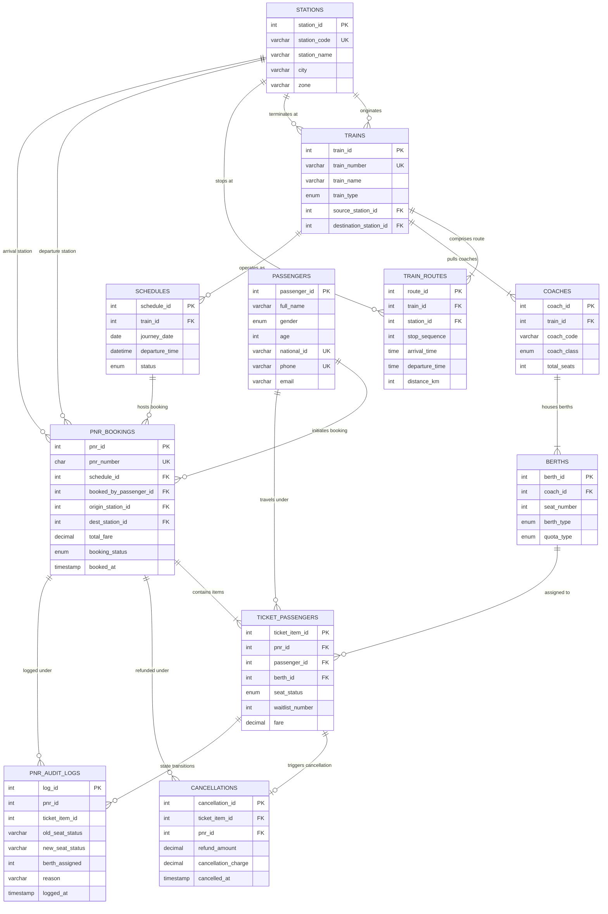

# Entity Relationship Diagram (ERD) & Architectural Data Dictionary

**Project**: Railway Seat Reservation & Dynamic Waitlist (PNR) Engine  
**Standard**: 3NF (Third Normal Form) Academic DBMS Benchmark  
**DBMS Engine**: MySQL 8.0+ (InnoDB Engine)  
**Encoding**: UTF-8 (`utf8mb4`)

---

## 1. Visual Entity Relationship Diagram (Crow's Foot Notation)

---

## 2. Comprehensive Relational Data Dictionary

### 2.1 Table: `stations`
Represents physical railway station terminals across geographic railway divisions.
| Column | Data Type | Nullable | Key / Constraint | Description |
| :--- | :--- | :--- | :--- | :--- |
| `station_id` | INT | NO | PK, AUTO_INCREMENT | Surrogate primary key for station node. |
| `station_code` | VARCHAR(10) | NO | UNIQUE, UK | Official alphanumeric station identifier (e.g. `NDLS`, `MMCT`). |
| `station_name` | VARCHAR(100) | NO | NONE | Official designated station name. |
| `city` | VARCHAR(100) | NO | NONE | City/municipality jurisdiction. |
| `zone` | VARCHAR(50) | NO | NONE | Railway management zone (e.g. Northern Railway). |
| `created_at` | TIMESTAMP | NO | DEFAULT CURRENT_TIMESTAMP | Record initialization timestamp. |

### 2.2 Table: `trains`
Master rolling stock schedule catalog.
| Column | Data Type | Nullable | Key / Constraint | Description |
| :--- | :--- | :--- | :--- | :--- |
| `train_id` | INT | NO | PK, AUTO_INCREMENT | Surrogate primary key for train entity. |
| `train_number`| VARCHAR(10) | NO | UNIQUE, UK | Train service number (e.g. `12952`). |
| `train_name` | VARCHAR(120) | NO | NONE | Official commercial service name. |
| `train_type` | ENUM(...) | NO | CHECK ('Express','Superfast','Passenger','Bullet') | Service operational speed classification. |
| `source_station_id` | INT | NO | FK (`stations.station_id`) | Terminal origin station. |
| `destination_station_id` | INT | NO | FK (`stations.station_id`) | Terminal destination station. |
| `created_at` | TIMESTAMP | NO | DEFAULT CURRENT_TIMESTAMP | Timestamp of registration. |

### 2.3 Table: `train_routes`
Ordered transit stop sequence for each train journey.
| Column | Data Type | Nullable | Key / Constraint | Description |
| :--- | :--- | :--- | :--- | :--- |
| `route_id` | INT | NO | PK, AUTO_INCREMENT | Surrogate primary key for route stop. |
| `train_id` | INT | NO | FK (`trains.train_id`) | Associated train service. |
| `station_id` | INT | NO | FK (`stations.station_id`) | Intermediate or terminal station stop. |
| `stop_sequence`| INT | NO | CHECK (`stop_sequence` > 0) | Monotonically increasing sequential stop index. |
| `arrival_time` | TIME | YES | NONE | Scheduled platform arrival time. |
| `departure_time`| TIME | YES | NONE | Scheduled platform departure time. |
| `distance_km` | INT | NO | CHECK (`distance_km` >= 0) | Cumulative track distance in kilometers from origin. |
| `created_at` | TIMESTAMP | NO | DEFAULT CURRENT_TIMESTAMP | Stop creation timestamp. |

*Composite Uniqueness*: `UNIQUE(train_id, stop_sequence)`, `UNIQUE(train_id, station_id)`.

### 2.4 Table: `coaches`
Carriages attached to physical train rakes.
| Column | Data Type | Nullable | Key / Constraint | Description |
| :--- | :--- | :--- | :--- | :--- |
| `coach_id` | INT | NO | PK, AUTO_INCREMENT | Surrogate primary key for coach entity. |
| `train_id` | INT | NO | FK (`trains.train_id`) | Train to which carriage is assigned. |
| `coach_code` | VARCHAR(10) | NO | NONE | Rake carriage code (e.g. `H1`, `A1`, `B1`, `S1`). |
| `coach_class` | ENUM(...) | NO | CHECK ('AC1','AC2','AC3','Sleeper','Economy') | Travel fare tier class. |
| `total_seats` | INT | NO | CHECK (`total_seats` > 0) | Physical seat layout capacity. |
| `created_at` | TIMESTAMP | NO | DEFAULT CURRENT_TIMESTAMP | Registry timestamp. |

*Composite Uniqueness*: `UNIQUE(train_id, coach_code)`.

### 2.5 Table: `berths`
Atomic physical seating units inside coaches.
| Column | Data Type | Nullable | Key / Constraint | Description |
| :--- | :--- | :--- | :--- | :--- |
| `berth_id` | INT | NO | PK, AUTO_INCREMENT | Surrogate primary key for seat. |
| `coach_id` | INT | NO | FK (`coaches.coach_id`) | Parent carriage containing the berth. |
| `seat_number` | INT | NO | CHECK (`seat_number` > 0) | Physical numbered position in coach. |
| `berth_type` | ENUM(...) | NO | CHECK ('Lower','Middle','Upper','Side_Lower','Side_Upper') | Ergonomic position. |
| `quota_type` | ENUM(...) | NO | DEFAULT 'General' | Allocation reservation quota. |
| `created_at` | TIMESTAMP | NO | DEFAULT CURRENT_TIMESTAMP | Creation timestamp. |

*Composite Uniqueness*: `UNIQUE(coach_id, seat_number)`.

### 2.6 Table: `passengers`
Master demographic directory of travelers.
| Column | Data Type | Nullable | Key / Constraint | Description |
| :--- | :--- | :--- | :--- | :--- |
| `passenger_id`| INT | NO | PK, AUTO_INCREMENT | Surrogate primary key. |
| `full_name` | VARCHAR(100) | NO | NONE | Passenger government registered name. |
| `gender` | ENUM(...) | NO | CHECK ('M','F','Other') | Gender classification. |
| `age` | INT | NO | CHECK (`age` > 0 AND `age` < 120) | Verified age. |
| `national_id` | VARCHAR(50) | NO | UNIQUE, UK | Citizen verification identifier. |
| `phone` | VARCHAR(20) | NO | UNIQUE, UK | Contact telephone number. |
| `email` | VARCHAR(100) | NO | NONE | Notification email address. |
| `registered_at`| TIMESTAMP | NO | DEFAULT CURRENT_TIMESTAMP | User registration timestamp. |

### 2.7 Table: `schedules`
Specific scheduled date-time runs of trains.
| Column | Data Type | Nullable | Key / Constraint | Description |
| :--- | :--- | :--- | :--- | :--- |
| `schedule_id` | INT | NO | PK, AUTO_INCREMENT | Schedule event ID. |
| `train_id` | INT | NO | FK (`trains.train_id`) | Train undertaking this run. |
| `journey_date`| DATE | NO | NONE | Scheduled calendar departure date. |
| `departure_time`| DATETIME | NO | NONE | Precise departure timestamp. |
| `status` | ENUM(...) | NO | DEFAULT 'Scheduled' | Operational status ('Scheduled','Running','Delayed','Cancelled'). |
| `created_at` | TIMESTAMP | NO | DEFAULT CURRENT_TIMESTAMP | Creation timestamp. |

*Composite Uniqueness*: `UNIQUE(train_id, journey_date)`.

### 2.8 Table: `pnr_bookings`
Header transactional dossier representing a booking transaction.
| Column | Data Type | Nullable | Key / Constraint | Description |
| :--- | :--- | :--- | :--- | :--- |
| `pnr_id` | INT | NO | PK, AUTO_INCREMENT | Internal surrogate primary key. |
| `pnr_number` | CHAR(10) | NO | UNIQUE, UK | Public 10-digit Passenger Name Record identifier. |
| `schedule_id` | INT | NO | FK (`schedules.schedule_id`) | Scheduled journey run. |
| `booked_by_passenger_id` | INT | NO | FK (`passengers.passenger_id`) | User who booked and paid for the ticket. |
| `origin_station_id` | INT | NO | FK (`stations.station_id`) | Passenger boarding station. |
| `dest_station_id` | INT | NO | FK (`stations.station_id`) | Passenger destination station. |
| `total_fare` | DECIMAL(10,2)| NO | CHECK (`total_fare` >= 0) | Aggregate booking transaction charge. |
| `booking_status`| ENUM(...) | NO | DEFAULT 'Waitlisted' | Header state ('Confirmed','Partially_Confirmed','Waitlisted','Cancelled'). |
| `booked_at` | TIMESTAMP | NO | DEFAULT CURRENT_TIMESTAMP | Transaction timestamp. |

### 2.9 Table: `ticket_passengers`
Granular line-item passenger manifests linked to a PNR.
| Column | Data Type | Nullable | Key / Constraint | Description |
| :--- | :--- | :--- | :--- | :--- |
| `ticket_item_id` | INT | NO | PK, AUTO_INCREMENT | Item primary key. |
| `pnr_id` | INT | NO | FK (`pnr_bookings.pnr_id`) | Parent PNR dossier. |
| `passenger_id` | INT | NO | FK (`passengers.passenger_id`) | Traveling individual. |
| `berth_id` | INT | YES | FK (`berths.berth_id`) | Assigned physical seat (NULL if WL). |
| `seat_status` | ENUM(...) | NO | DEFAULT 'WL' | State machine value ('CNF','RAC','WL','CAN'). |
| `waitlist_number`| INT | YES | CHECK (condition) | 1-indexed FIFO waitlist position (NULL if CNF/CAN). |
| `fare` | DECIMAL(8,2) | NO | CHECK (`fare` >= 0) | Individual passenger ticket cost. |
| `updated_at` | TIMESTAMP | NO | ON UPDATE CURRENT_TIMESTAMP | Automatic update timestamp. |

### 2.10 Table: `cancellations`
Financial adjustment ledger for refunded tickets.
| Column | Data Type | Nullable | Key / Constraint | Description |
| :--- | :--- | :--- | :--- | :--- |
| `cancellation_id` | INT | NO | PK, AUTO_INCREMENT | Primary key. |
| `ticket_item_id` | INT | NO | FK, UNIQUE | One-to-one link to cancelled line-item. |
| `pnr_id` | INT | NO | FK (`pnr_bookings.pnr_id`) | Parent PNR dossier. |
| `refund_amount` | DECIMAL(8,2) | NO | CHECK (`refund_amount` >= 0) | Net funds refunded to passenger. |
| `cancellation_charge` | DECIMAL(8,2) | NO | CHECK (`cancellation_charge` >= 0) | Administrative cancellation penalty retained. |
| `cancelled_at` | TIMESTAMP | NO | DEFAULT CURRENT_TIMESTAMP | Cancellation timestamp. |

### 2.11 Table: `pnr_audit_logs`
Append-only immutable audit trail recording state transitions and berth reassignments.
| Column | Data Type | Nullable | Key / Constraint | Description |
| :--- | :--- | :--- | :--- | :--- |
| `log_id` | INT | NO | PK, AUTO_INCREMENT | Log sequence number. |
| `pnr_id` | INT | NO | NONE | Associated PNR ID. |
| `ticket_item_id` | INT | NO | NONE | Associated ticket item ID. |
| `old_seat_status` | VARCHAR(20) | NO | NONE | Previous status before trigger/procedure execution. |
| `new_seat_status` | VARCHAR(20) | NO | NONE | Resulting status after execution. |
| `berth_assigned` | INT | YES | NONE | Berth ID allocated (if confirmed). |
| `reason` | VARCHAR(255) | NO | NONE | State machine transition justification. |
| `logged_at` | TIMESTAMP | NO | DEFAULT CURRENT_TIMESTAMP | Timestamp of audit log event. |

---

## 3. Formal 3NF (Third Normal Form) Normalization Proofs

### 3.1 First Normal Form (1NF) Compliance
- **Rule**: Every attribute must be atomic; no repeating groups, CSV lists, or composite multi-valued columns.
- **Proof**:
  - Passenger names, station codes, and seat numbers are atomic scalar values.
  - Multi-passenger bookings are decomposed into `pnr_bookings` (1) and `ticket_passengers` (N). There is no repeating column array (e.g. `passenger_1`, `passenger_2`).
  - Train routes are normalized into ordered rows in `train_routes`, rather than comma-separated station IDs in the `trains` table.

### 3.2 Second Normal Form (2NF) Compliance
- **Rule**: Must be in 1NF, and all non-prime attributes must be fully functionally dependent on the entire primary key (no partial dependencies on composite keys).
- **Proof**:
  - In `train_routes`, composite candidate keys exist: `(train_id, stop_sequence)` and `(train_id, station_id)`. The non-key attributes (`arrival_time`, `departure_time`, `distance_km`) depend on the specific station stop for that specific train sequence, not on `train_id` alone or `station_id` alone.
  - In `berths`, candidate key `(coach_id, seat_number)` uniquely determines `berth_type` and `quota_type`. Berth ergonomics depend on the specific seat in that coach layout, satisfying full functional dependency.

### 3.3 Third Normal Form (3NF) Compliance
- **Rule**: Must be in 2NF, and no non-prime attribute may transitively depend on another non-prime attribute ($X \rightarrow Y$ where $Y \rightarrow Z$ and $X$ is primary key).
- **Proof**:
  - `ticket_passengers` holds `passenger_id`, but does NOT duplicate `full_name`, `age`, or `national_id`. If demographic data were stored in `ticket_passengers`, a transitive dependency would exist: `ticket_item_id -> passenger_id -> full_name`. Eliminating this by isolating `passengers` achieves strict 3NF.
  - `coaches` stores `train_id`, but does NOT duplicate `train_type` or `train_name`.
  - `pnr_bookings` links to `schedules`, but does NOT duplicate `journey_date` or `train_id`.
  - Financial adjustments (`refund_amount`, `cancellation_charge`) are strictly isolated in `cancellations`, preserving clean transactional separation without polluting master reservation rows.
